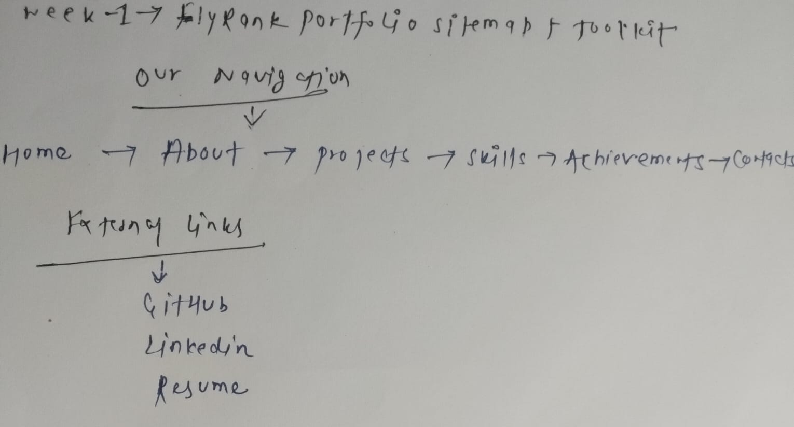
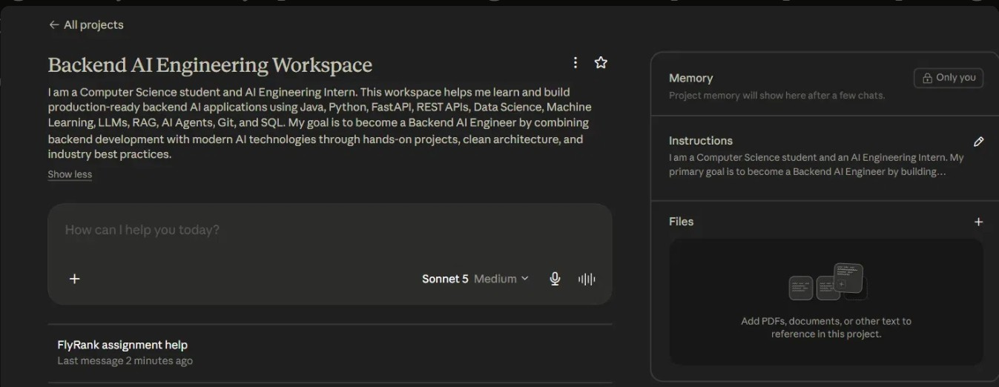
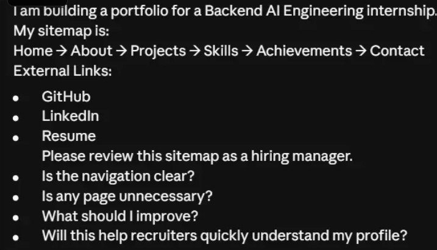
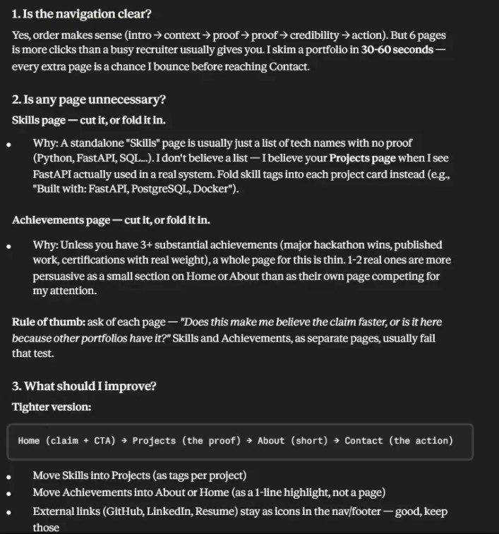

# FlyRank Week 1 — Draw the Path: Portfolio Sitemap + Toolkit

## 1. Portfolio Sitemap
Home → About → Projects → Skills → Achievements → Contact

**External Links:** GitHub, LinkedIn, Resume

## 2. Claude Project Setup
Created a dedicated Claude Project ("Backend AI Engineering Workspace") 
with custom instructions describing my goals and background.

## 3. Pressure-Test Prompt
Asked Claude to review my sitemap as a hiring manager for a 
Backend AI Engineering internship.

## 4. Output

## My Decision
I will keep my current portfolio structure because it matches my existing 
website and provides clear navigation. I plan to integrate technical skills 
into individual project descriptions over time, as recommended. I am keeping 
the Achievements page because it already showcases my certifications and 
accomplishments, making them easy for recruiters to find. I will continue 
improving the portfolio as I build more real-world projects.
